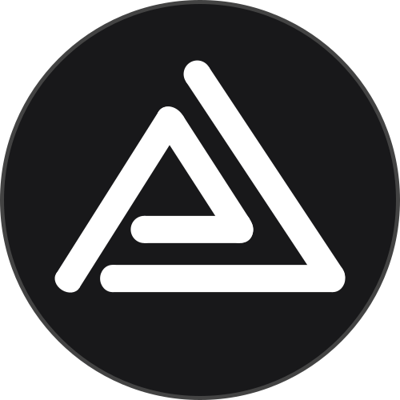
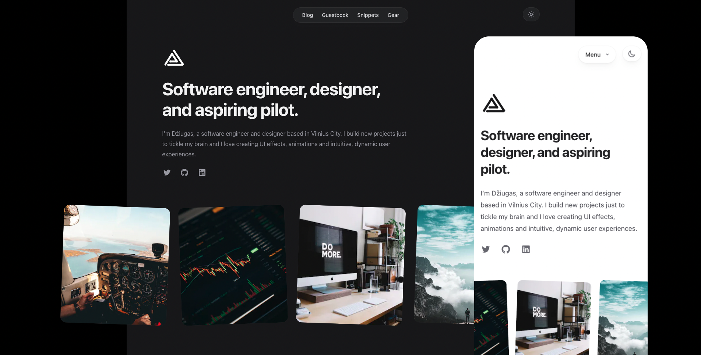

<div align="center">
  
</div>
<h1 align="center">
  peciulevicius.com - v2
</h1>
<p align="center">
  Second iteration of <a href="https://peciulevicius.com" target="_blank">peciulevicius.com</a> built with <a href="https://nextjs.org/" target="_blank">Next.js</a> and hosted with <a href="https://vercel.com/" target="_blank">Vercel</a>
</p>
<p align="center">
  Previous iteration:
  <a href="https://github.com/peciulevicius/dziugaspeciulevicius.github.io" target="_blank">v1</a>
</p>

<p align="center">

</p>



## Getting started

To get started with this template, first install the npm dependencies:

```bash
npm install
```

Next, create a `.env.local` file in the root of your project and set the `NEXT_PUBLIC_SITE_URL` variable to your site's public URL:

```
NEXT_PUBLIC_SITE_URL=https://example.com
```

Next, run the development server:

```bash
npm run dev
```

Finally, open [http://localhost:3000](http://localhost:3000) in your browser to view the website.

## Learn more

To learn more about the technologies used in this site template, see the following resources:

- [Tailwind CSS](https://tailwindcss.com/docs) - the official Tailwind CSS documentation
- [Next.js](https://nextjs.org/docs) - the official Next.js documentation
- [Headless UI](https://headlessui.dev) - the official Headless UI documentation
- [MDX](https://mdxjs.com) - the MDX documentation
